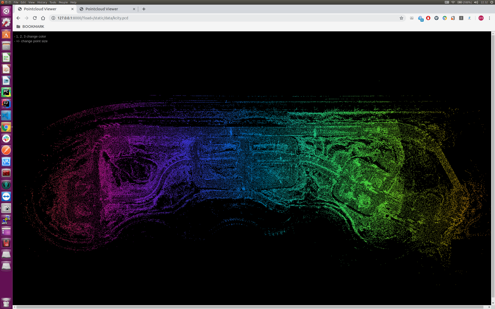
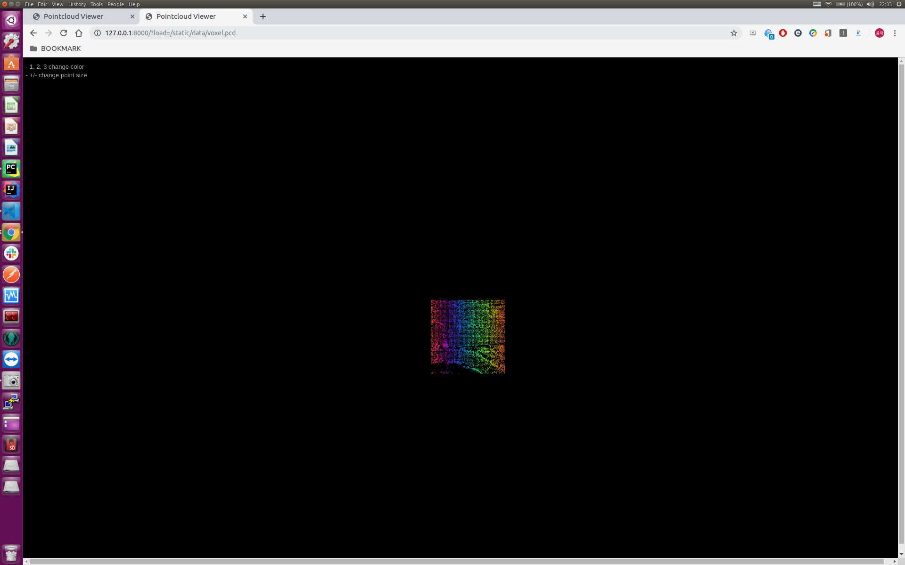

Explanation
------
- Put your .pcd file in "static/data/" directory.
- You can choose web framework. I used Django.
- Recommend running web browser private mode.(because cache data)
- You can set your screen through `camera.position(x,y,z)` and `controls.target.set()`

Run & Address
------
url : `https://\<IP:port_number\>/?load=/static/data/<\file_name\>.pcd`

Result
------

This image show Kcity(South Korea Autonomous Vehicle Experiment City) pcd map.  

This image show fragment pcd file in Kcity.
 
